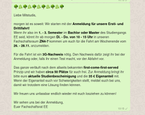
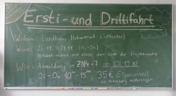
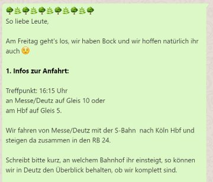
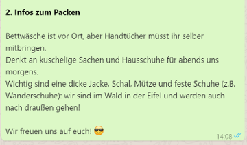
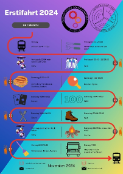

# How-To: Erstifahrt

**Version:** 1.0.0 (Stand: 12.01.2025)  
**Ziel:** Sicherstellung eines reibungslosen Ablaufs bei der Organisation und Durchführung der Erstifahrt, inklusive klarer Aufgabenverteilung und Abrechnung.

---

## Inhaltsverzeichnis

1. [Zeitraum bestimmen](#1-zeitraum-bestimmen)
2. [Haus anfragen](#2-haus-anfragen)
3. [Anmeldung](#3-anmeldung)
4. [Kompetenzteams bilden](#4-kompetenzteams-bilden)
5. [Finanzierung](#5-finanzierung)
6. [Letzte Erinnerung](#6-letzte-erinnerung)
7. [Organisation während der Fahrt](#7-organisation-während-der-fahrt)
8. [Nach der Fahrt](#8-nach-der-fahrt)
9. [Sonstiges](#9-sonstiges)

---

## 1. Zeitraum bestimmen

- Frühzeitig planen: Optimal ab Januar, spätestens April.
- Klassischer Termin: **Ein Wochenende Anfang November**.
- Beispielkapazitäten:
  - **Landhaus Hohenfried**: 12 Betreuerbetten, 48 Zimmerbetten (1x6, 5x8, 2x1).
  - Platz für 2 auf der Couch, 4 auf Luftmatratzen.
- Mindestens **10 Helfende** bei 50 Erstis einplanen.
- **FS-Mitglieder mit Auto:** Mindestens 2 Personen für Einkäufe und Transport.

---

## 2. Haus anfragen

- **Empfohlene Unterkünfte:**
  - [Landhaus Hohenfried](https://www.landhaus-hohenfried.de/)
  - Weitere Häuser auf [gruppenhaus.de](https://www.gruppenhaus.de).
- Kriterien:
  - In NRW oder mit Deutschlandticket erreichbar.
  - Frühzeitige Anfrage (mindestens 6 Monate im Voraus).

---

## 3. Anmeldung

- **Promo starten:**

  - WhatsApp-Gruppe mit Infos (siehe Anhang).
  - Insta-Story oder Beitrag.
  - GE oder Mathe-Veranstaltung besuchen (Prof um Erlaubnis bitten).

- **Anmeldeliste erstellen:**

  - Google Docs oder Excel-Liste:
    - Name, Matrikelnummer, Telefonnummer, Unverträglichkeiten, Eigenanteil bezahlt, Studienbescheinigung, Eigenständigkeitserklärung.
  - Personen benennen, die sich um die Anmeldung kümmern.
  - ILIAS-Gruppe erstellen oder Studienbescheinigungen per E-Mail sammeln.

- **Was Erstis mitbringen müssen:**

  - **MultiCa**, Eigenanteil (35–50 €), unterschriebene Eigenständigkeitserklärung.
  - WhatsApp-Gruppe beitreten.

- **Warteliste:**
  - Falls nötig, Warteliste erstellen und Nachrückende per „first-come, first-serve“-Prinzip informieren.

---

## 4. Kompetenzteams bilden

- **Mögliche Rollen:**

  - Unterkunft, Finanzen, Zeitplan, Essen, Getränke, Spiele, An-/Abreise.
  - Studienbescheinigungen/Unterschriften, Kommunikation.

- **Essensplanung:**

  - Mahlzeiten bestimmen: 2x Frühstück, 1x Mittagessen, 2x Abendessen.
  - Einkaufsliste erstellen.

- **Programmplanung:**
  - Freitag: Vorstellungsrunde, Kennenlernspiele, Party.
  - Samstag: Spiele draußen, Freizeit, Nachtwanderung, Feuer, Party.
  - Benötigtes Material: Mikrofon, Boxen, Bierpong-Sets, Knicklichter.

---

## 5. Finanzierung

- **QVM-Antrag:**
  - 40 € pro Person (Erstis und Helfende).
  - Vorlage im Ordner „Kasse“.
- **Eigenanteil:**
  - Normalerweise 35 € (2024: 50 €).
- **FSVK-Gelder:**
  - 5 € pro Person/Tag (max. 15 € für dreitägige Fahrten).
  - Unterschriebene Teilnehmendenliste und Studienbescheinigungen erforderlich.

---

## 6. Letzte Erinnerung

- **Packliste:**
  - Handtuch, warme Kleidung, Hausschuhe, Kulturbeutel, Getränke, Bargeld.
- **Reiseinfos:**
  - Treffpunkt und Zugverbindung bekannt geben.
  - Zeitplan mitschicken.

---

## 7. Organisation während der Fahrt

- **Abfahrt:**
  - Mindestens 2 Personen pro Bahnhof.
  - Anwesenheit prüfen.
- **Vor Ort:**
  - Teams für Mahlzeiten organisieren (Kochen, Spülen, Tisch decken).
  - Hausordnung beachten.

---

## 8. Nach der Fahrt

- **Abrechnung:**
  - Alle Rechnungen und Belege beim QVM-Beauftragten einreichen.
- **Feedback:**
  - Umfrage erstellen oder Treffen organisieren.
- **Nachbesprechung:**
  - Probleme und Verbesserungen dokumentieren.

---

## 9. Sonstiges

- **Minderjährige Studierende:**
  - Unter-18-Jährige sind voll rechtsfähig (in NRW und BW).

---

## Anhang

### WhatsApp-Text:

### Tafelbild für Instabeitrag:

### Letzte Erinnerung:

### Zeitplan

### Beispiel Gruppenbeschreibung für WhatsApp

Hello 👋  
Die Erstifahrt rückt näher und die Planung schreitet voran 😁  
Wir brauchen eure Studienbescheinigungen, um Fördermittel von der TH beziehen zu können. Es muss das Hochschulsemester, die Matrikelnummer und der Name ersichtlich sein, es steht euch frei, den Rest zu schwärzen.

Die Studienbescheinigung könnt ihr bei Cams herunterladen:  
[Studienservices -> Bescheide/Bescheinigungen](https://cams.th-koeln.de/qisserver/pages/cs/sys/portal/hisinoneStartPage.faces)

Schickt diese dann bitte an **fachschaftsrat.fs-et@f07.th-koeln.de**.

🌳🌳🌳🌳🌳🌳🌳🌳🌳🌳🌳🌳🌳🌳🌳

**Reiseinformationen:**  
Wir fahren am **Freitag um 15:40 Uhr** an Messe/Deutz Gleis 7 bzw. **15:43 Uhr** Köln HBF Gleis 5 mit dem RB24 nach Kall, werden dort ~16:52 ankommen und mit einem gemieteten Reisebus weiterfahren, sodass wir ~17:30 ankommen 🌳

Zurück geht es am **Sonntag um 11:00 Uhr**, erst mit dem gemieteten Bus nach Kall und um **11:42 Uhr** mit dem RE22 zurück, sodass wir **12:39 Uhr in Köln HBF Gleis 1** und **12:45 Uhr wieder an Messe/Deutz Gleis 2** sind 🌳

🌳🌳🌳🌳🌳🌳🌳🌳🌳🌳🌳🌳🌳🌳🌳

**Packliste:**

- Handtuch (keine Bettwäsche)
- Feste Schuhe, warme Jacke, Mütze, Schal (Es soll Freitag in der Gegend schneien und wir werden nicht nur drinnen sein)
- Gemütliche Klamotten
- Hausschuhe
- Kulturbeutel
- Getränke nach Wahl
- Bargeld für Bier und Limo
