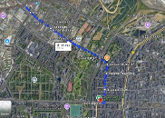
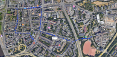

# How-To: Büdchentour

**Version:** 1.0.0 (Stand: 12.01.2025)  
**Ziel:** Organisation und Durchführung einer erfolgreichen Büdchentour zur Vernetzung und zum Kennenlernen von Stadtteilen und Mitstudierenden.

---

## Ablauf und Organisation

### 1. Termincheck

- Mit der allgemeinen Orga abstimmen, ob der Termin weiterhin passend ist.
- **Stundenpläne prüfen:** Sicherstellen, dass es keine größeren Überschneidungen gibt.

---

### 2. Routenplanung

- **Laufzeit:** Etwa 1 Stunde (~5 km) als Richtwert.
  - **Hinweis:** Die Gruppe läuft in der Regel relativ zügig.
- **Wichtige Punkte beachten:**
  - Essensmöglichkeiten einplanen.
  - Toilettenstopps berücksichtigen.
  - Stadtteile, die selten besucht werden (z. B. Deutz/rechtsrheinisch), einbinden.
  - Bahnanbindung prüfen und Ausfälle einkalkulieren.
- **Sonstige Empfehlungen:**
  - Fahne oder anderes Erkennungszeichen für den Gruppenanfang nutzen.
  - Standort teilen, damit Nachkommende die Gruppe finden können.

**Beispiel 2024:**

- Start an der TH.
- Kleine Tour durch Deutz (ursprünglich zur S-Bahn, wegen Ausfall Umplanung zu U3/4 nach Ehrenfeld).
- Über Venloer Straße/Grüngürtel zum Breslauer Platz.
- Ende im **Low Budget**.

---

### 3. Büdchen-Planung

- **Auswahl der Büdchen:**
  - Kann spontan erfolgen (es gibt genug Büdchen).
  - Optional: Kurze Infos zu den Büdchen vorbereiten.
- **Logistische Aspekte:**
  - Büdchen mit ausreichend Platz auswählen, damit die Gruppe nicht auf der Straße steht.
  - Keine Beschwerden von Büdchen bekannt (2024).
- **Haltezeiten:**
  - Normale Stopps: 10 Minuten.
  - Essenstopps: 30 Minuten (z. B. Breslauer Platz war gut).

---

### 4. End-Planung

- **Bar am Ende der Tour:**
  - Bar suchen und ggf. vorher anfragen.
  - Rabatt oder ähnliches ist oft schwierig (Beispiel: Schroffe Antwort vom **Low Budget**).
  - Alternativ: Einfach dorthin gehen, wo ausreichend Platz ist.
- **Flexibilität:**
  - Erstis fragen, wie weit sie noch laufen möchten.
  - **Montag bis Mittwoch:** Geringere Bar-Aktivität, daher meist keine Reservierung nötig.

---

### 5. Generelles

- **Werbung:**
  - WhatsApp und Instagram nutzen.
- **Einführung:**
  - Zu Beginn der Tour an der TH einführende Worte halten, um alle abzuholen.
- **Standort teilen:**
  - Nachkommende können so die Gruppe finden.
- **Gruppenaufteilung:**
  - Am Ende der Tour ist eine Aufteilung gut möglich.

---

### 6. Was wird benötigt?

- **Personal:**
  - Mindestens 2 Personen für Planung und Gruppenführung.
- **Material:**
  - Musikbox und ein paar Kästen Getränke am Startpunkt bei der TH.
  - Handy mit vollem Akku oder Powerbank (Standort-Sharing verbraucht viel Akku).

---

## Changelog

- **12.01.2025 (v1.0.0):** Erste Version erstellt.
